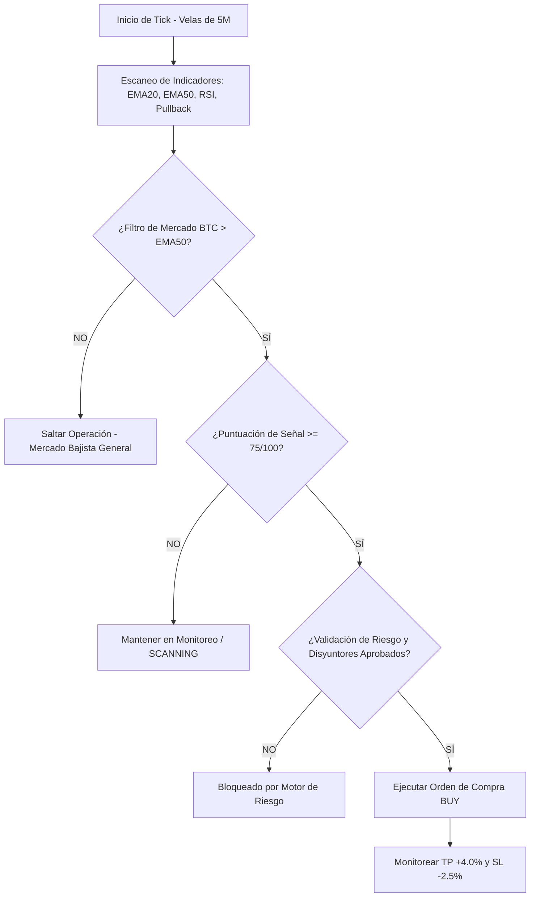

# 📘 Manual de Operación y Funcionamiento
## Coinbase Automated Trading Bot v1.0 Pro

Este manual explica detalladamente la arquitectura, la estrategia cuantitativa de trading, los mecanismos de seguridad y los procedimientos operativos de la plataforma.

---

## 1. ⚙️ Funcionamiento General de la Plataforma

El **Coinbase Automated Trading Bot** es un sistema de trading cuantitativo diseñado para escanear los mercados de criptomonedas (**BTC-USD**, **ETH-USD**, **SOL-USD**) en velas de **5 minutos** e identificar patrones de compra de alta probabilidad.

### Modos de Operación
1. **PAPER TRADING (Simulado por Defecto):**
   * Opera con **$1,000.00 USD de saldo virtual**.
   * Simula comisiones reales de Coinbase Advanced (**0.60% Taker Fee**) y deslizamiento de precio (*Slippage* 0.05%).
   * **No requiere usar dinero real ni credenciales.**
2. **LIVE TRADING (Modo Real):**
   * Desactivado por defecto.
   * Conecta directamente con la API de **Coinbase Advanced Trade** usando claves CDP (Coinbase Developer Platform).
   * Requiere confirmación de seguridad en la interfaz escribiendo `ENABLE LIVE TRADING`.

---

## 2. 🧠 Estrategia Cuantitativa de Trading (5M Pullback Strategy)

El bot evalúa continuamente 5 condiciones matemáticas antes de tomar una posición:

| Indicador / Regla | Condición Requerida | Razón Cuantitativa |
| :--- | :--- | :--- |
| **1. Filtro General de Mercado** | BTC-USD > EMA 50 | Evita comprar altcoins cuando Bitcoin está en tendencia bajista. |
| **2. Tendencia del Activo** | EMA 20 > EMA 50 | Garantiza que el activo esté en estructura alcista de corto plazo. |
| **3. Oscilador RSI (14)** | RSI entre 35 y 48 | Identifica zonas donde el activo se ha enfriado sin caer en sobreventa extrema. |
| **4. Retroceso (Pullback %)** | -2.0% a -4.5% desde el máximo | Entra en caídas temporales dentro de una tendencia alcista primaria. |
| **5. Signal Score Threshold** | Puntuación ≥ 75 / 100 | Solo ejecuta operaciones donde la combinación de factores sea óptima. |

### Reglas de Salida Fijas
* **Take Profit (TP):** **+4.0%** sobre el precio de entrada.
* **Stop Loss (SL):** **-2.5%** sobre el precio de entrada.
* **Ratio Riesgo/Beneficio:** **1 : 1.6** (Ganancia esperada superior al riesgo asumido).

---

## 3. 🛡️ Motor de Gestión de Riesgo (Circuit Breakers)

Para proteger el capital en condiciones adversas de mercado, el bot incluye 4 barreras automáticas:

1. **Exposición Máxima Total ($300.00 USD):** Ninguna combinación de operaciones abiertas puede superar los $300 acumulados.
2. **Límite de Pérdida Diaria ($15.00 USD):** Si las pérdidas acumuladas del día alcanzan $15, el bot pausa las entradas automáticamente hasta el día siguiente.
3. **Límite de Pérdida Semanal ($40.00 USD):** Pausa las entradas hasta la siguiente semana UTC.
4. **Disyuntor de Drawdown Máximo (10% HALT):** Si la cuenta cae un 10% desde su pico más alto, el estado del bot pasa a **HALTED** y requiere revisión manual.

---

## 4. 🎛️ Guía de Uso del Dashboard

### 1. Barra de Control Superior
* **Botón START BOT:** Inicia el escaner de mercado automático.
* **Botón PAUSE:** Pausa nuevas compras pero mantiene el monitoreo de posiciones abiertas para TP/SL.
* **Botón STOP:** Detiene el bot por completo.
* **Botón Stop (Liquidación de Emergencia):** Cierra inmediatamente todas las posiciones abiertas a precio de mercado.

### 2. Pestaña Settings & API (`/dashboard/settings`)
En esta sección puedes:
* Configurar tu **Coinbase API Key** y **API Secret (PEM Key)**.
* Probar la conexión mediante el botón **"Test Coinbase API Connection"**.
* Modificar los parámetros de TP, SL, tamaño de órdenes por activo y límites de pérdida.

---

## 5. ❓ Pregunta Frecuente: Pruebas Locales vs Despliegue en la Nube

### **¿Puedo hacer las pruebas en local conectando la API?**

> **¡SÍ, TOTALMENTE!** 

Puedes ejecutar y probar la plataforma **100% en tu computadora local** (`http://localhost:3000`).

#### ¿Cómo probar en local?
1. **En modo PAPER TRADING:** Solo haz clic en **START BOT** en la barra superior. No necesitas configurar nada de API.
2. **En modo LIVE TRADING con la API de Coinbase:**
   * Ve a **Settings & API** en el dashboard.
   * Ingrese tu **API Key** y **API Secret** de Coinbase.
   * Haz clic en **Test Coinbase API Connection** para verificar la comunicación.
   * Cambia el modo a **LIVE TRADING** si deseas ejecutar operaciones reales desde tu máquina.

---

### **¿Cuándo se necesita subir a GitHub / Vercel / Supabase?**

Únicamente necesitas desplegar en la nube si deseas **automatizar el bot 24 horas al día, 7 días a la semana de forma desatendida**, sin necesidad de tener tu computadora encendida.

| Característica | Ejecución Local (`localhost:3000`) | Despliegue en Nube (Vercel + Supabase) |
| :--- | :--- | :--- |
| **¿Necesita tu PC encendida?** | SÍ | NO (Corre 24/7 en la nube) |
| **Pruebas y Simulación (Paper)** | ✅ Ideal para desarrollo | ✅ Disponible |
| **Conexión API Coinbase** | ✅ Funciona directamente | ✅ Funciona vía Supabase Edge Functions |
| **Ejecución Automática 24/7** | No (se detiene al apagar la PC) | ✅ Vía `pg_cron` en Supabase |
| **Costo** | $0 Gratis | Plan gratuito de Supabase & Vercel |

---

## 🚀 Resumen Operativo

1. Puedes usar la plataforma **hoy mismo en tu PC local**.
2. Empieza en **PAPER TRADING** para verificar el comportamiento de la estrategia.
3. Cuando decidas dejarlo corriendo 24/7 sin mantener tu PC encendida, sigue la guía de `DEPLOYMENT.md` para subirlo a Vercel y Supabase.
